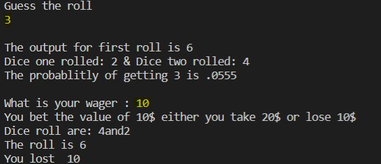

## Guess The Roll

## Demo

## Description

This program ask you to guess the sum of roll of two dice. That is guess any number from 1-12. Then you can put a wager of amount of money you desire if you win you get the double the money or else you lose the money. You are also given a probabilty of the number you guessed.

## Language

- Java
